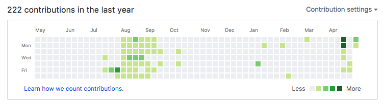

# change-contributions-box
可以修改你GitHub上绿色contributions墙的脚本

### 效果图

- 改变前: 

- 改变后: 

### 使用方法

1. 在GitHub新建一个空的仓库

2. 在电脑上clone这个空项目到本地

3. 进入空项目目录,将本仓库中的count.py文件复制到你的空仓库内

4. 运行python脚本: `python count.py`

5. 等待3-5分钟,脚本运行完毕后去GitHub刷新页面查看结果

### 注意

GitHub可能有延迟,稍微等待即可

脚本可以执行多次 效果可叠加

造假终归不是正途,删除GitHub上新建的项目仓库即可复原,且行且珍惜